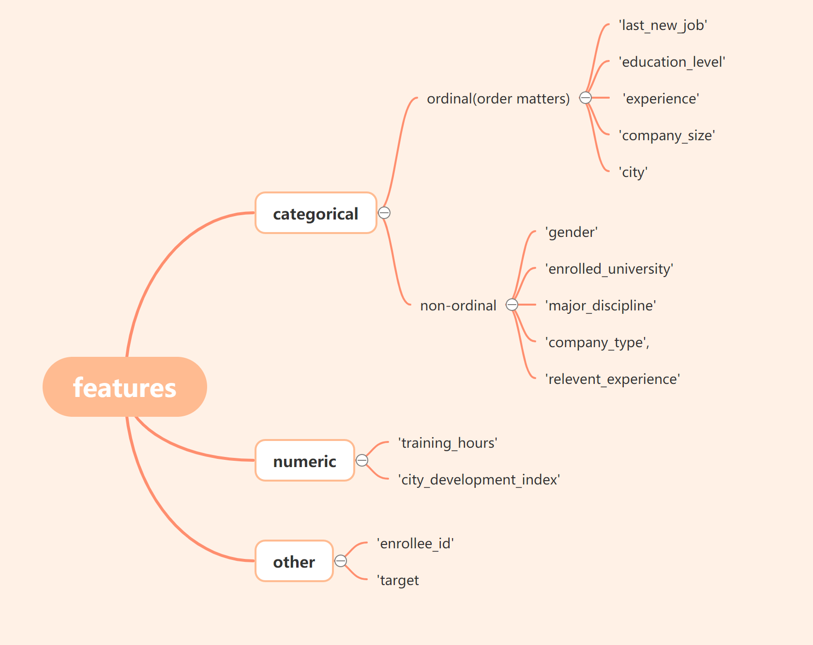
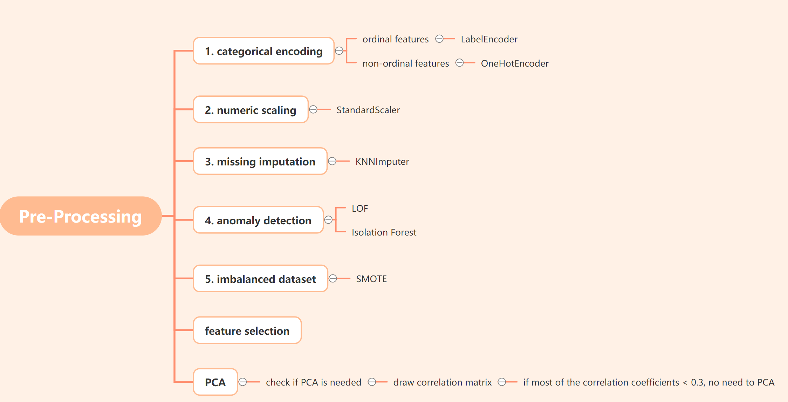
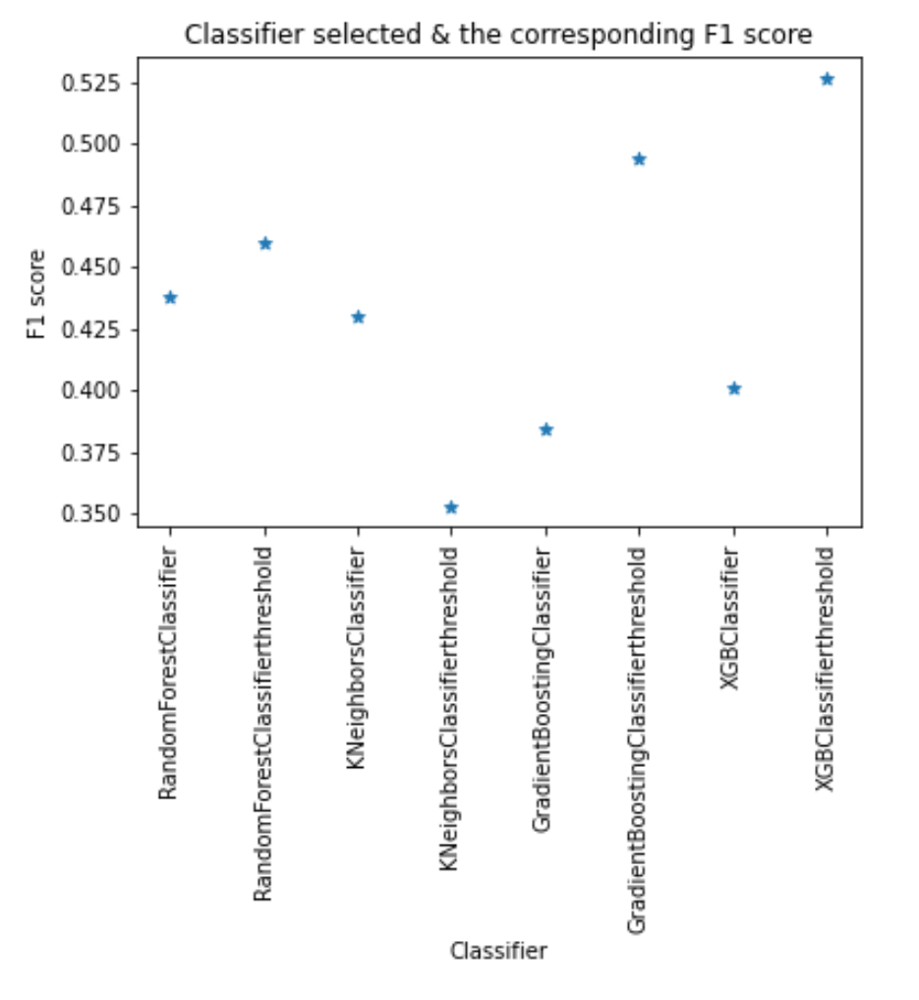

# HR_Analytics_project
 

<!-- TABLE OF CONTENTS -->

  
Table of Contents

  <ol>
    <li>
      <a href="#about-the-project">About The Project</a>
      <ul>
        <li><a href="#built-with">Built With</a></li>
      </ul>
    </li>
    <li><a href="#pre-processing">Pre Processing</a></li>
    <li><a href="#select-metrics">Select Evaluation Metrics</a></li>
    <li><a href="#model-building">Model Building</a></li>
    <li><a href="#evluation">Evluation</a></li>
    <li><a href="#contact">Contact</a></li>
    <li><a href="#acknowledgements">Acknowledgements</a></li>
  </ol>

<!-- ABOUT THE PROJECT -->
## About The Project
  A tech company is going to hire some data scientists among candidates that reach certain standard. Based on portfolios of the employees who already got in, and portofolio of the current candidates, they want to know which candidate has higher chances to pass.

### goals
* want to predict:

&emsp;&emsp; 1. predict whether a candidate for a job position will be given a offer or not. In a nutshell, class Label (0/1).

&emsp;&emsp; 2. predict the probability a candidate would be accepted. In other words, the probability of positive label.

### dataset
* The dataset contains candidates' personal information, more specifically the following:  

## Built With
* [Jupyter Notebook](https://jupyter.org/)

## Pre Processing  

## Select Evaluation Metrics  

- What I would choose: F1  
- Why not these metrics?  
  - Recap: Confusion matrix
  - | Actual\ Predicted |       1        |       0       |
    |      :---         |     :---:      |      ---:     |
    |       1           |       TP       |       FN      |
    |       0           |       FP       |       TN      |
    
  - *Accuracy*
  - - acc = 
  - - Say we have an imbalanced dataset: only 25% positive class, the rest belongs to negative class.
  - - If we predict all as negative, we get an accuracy of 75%.
  - - That mean a bad classifier can have a good accuracy score in the imbalanced case.
  
  - *ROC AUC*
  - - ROC AUC is used when we consider both classes equally important.
  - - In our case, we pay more attention to candidates who will be accepted (positive class). Two classes are not equally important.
  
  - *Precision*
  - - precision = 
  - - If we predict all as negative, the confusion matrix would be look like the following:
  - - | Actual\ Predicted |       1           |       0       |
      |      :---         |       :---:       |      ---:     |
      |       1           |       TP = 0      |       FN      |
      |       0           |       FP = 0      |       TN      |
  - - precision = 
  - - Again, a bad classifier would get a decent precision score. 
  
  - *Recall*
  - - recall = 
  - - If we predict all as positive, the confusion matrix would be look like the following:
  - - | Actual\ Predicted |       1           |       0       |
      |      :---         |       :---:       |      ---:     |
      |       1           |       TP          |       FN = 0  |
      |       0           |       FP          |       TN = 0  |
  - - recall = 
  - - Again, a bad classifier would get a decent precision score

## Model Building
After feature engineering, I nned to select algorithms/models that suit the dataset.

### requirements
&emsp;&emsp; 1. Linear models might NOT be complicated enough to sufficiently describe the relationship between target & features.  
&emsp;&emsp; 2. Should be good at preventing overfitting.  
&emsp;&emsp; 3. Can handle imbalanced binary classification well.  

### models
* KNN:  
&emsp;&emsp; 1. No assumptions about data.  
&emsp;&emsp; 2. versatile - works both for regression and classification.    
&emsp;&emsp; 3. Quick calculation time.    

* Random Forest:  
&emsp;&emsp; 1. RF is a great classifier that doesn't require extensive tuning for optimal performance.  
&emsp;&emsp; 2. RF doesn't need any prior assumption about the distribution of data.  
&emsp;&emsp; 3. RF tends to have low bias.  
&emsp;&emsp; 4. RF runs fast.  

* Gradient Boost:  
&emsp;&emsp; 1.   
&emsp;&emsp; 2. 

* XGBoost:   
&emsp;&emsp; 1. works well on small sample sizes, as what we have in this case. Also runs fast & easy to implement.  
&emsp;&emsp; 2. The nature of an ensemble learning algorithum(combines multiple weak learners sequentially) makes it learn more complex relationships between features& targets.  

## Evaluation

<!-- CONTACT -->
## Contact

Jiayi Yu - yu.jiayi@mail.utoronto.ca

Project Link: [https://github.com/jyyy750/HR_Analytics_project](https://github.com/jyyy750/HR_Analytics_project)

<!-- ACKNOWLEDGEMENTS -->
## Acknowledgements
* [README-Template](https://github.com/othneildrew/Best-README-Template/blob/master/README.md#about-the-project)
* [Kaggle](https://www.kaggle.com/arashnic/hr-analytics-job-change-of-data-scientists)
* [Machine-Learning-Mastery](https://machinelearningmastery.com/framework-for-imbalanced-classification-projects/)
* [Basic-writing-and-formatting-syntax](https://docs.github.com/en/github/writing-on-github/basic-writing-and-formatting-syntax)
* [Online-Latex-Equation-Editor](https://www.codecogs.com/latex/eqneditor.php)
