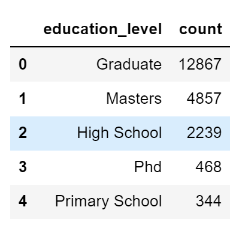
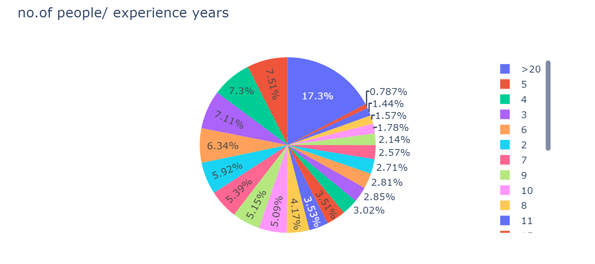

# HR_Analytics_project
 

<!-- TABLE OF CONTENTS -->

  
Table of Contents

  <ol>
    <li>
      <a href="#about-the-project">About The Project</a>
      <ul>
        <li><a href="#built-with">Built With</a></li>
      </ul>
    </li>
    <li><a href="#eda">EDA</a></li>
     <li><a href="#feature-engineering">Feature Engineering</a></li>
    <li><a href="#model-building">Model Building</a></li>
    <li><a href="#contact">Contact</a></li>
    <li><a href="#acknowledgements">Acknowledgements</a></li>
  </ol>

<!-- ABOUT THE PROJECT -->
## About The Project
  A tech company is going to hire some data scientists among candidates that reach certain standard. They want to know which candidate has higher chances to pass, based on portfolios of the employees who already got in.

### goals
* We have a few goals for this project:  

&emsp;&emsp; 1. predict whether a candidate for a job position will be given a offer or not.

&emsp;&emsp; 2. interpret which features affect candidate decision.

### dataset
* The dataset contains candidates' personal information, more specifically the following:  

&emsp;&emsp; 1. enrollee_id : Unique ID for candidate

&emsp;&emsp; 2. city: City code

&emsp;&emsp; 3. city_ development _index : Developement index of the city (scaled)

&emsp;&emsp; 4. gender: Gender of candidate

&emsp;&emsp; 5. relevent_experience: Relevant experience of candidate

&emsp;&emsp; 6. enrolled_university: Type of University course enrolled if any

&emsp;&emsp; 7. education_level: Education level of candidate

&emsp;&emsp; 8. major_discipline :Education major discipline of candidate

&emsp;&emsp; 9. experience: Candidate total experience in years

&emsp;&emsp; 10. company_size: No of employees in current employer's company

&emsp;&emsp; 11. company_type : Type of current employer

&emsp;&emsp; 12. lastnewjob: Difference in years between previous job and current job

&emsp;&emsp; 13. training_hours: training hours completed

&emsp;&emsp; 14. target: 0 – Not looking for job change, 1 – Looking for a job change

## Built With
* [Jupyter Notebook](https://jupyter.org/)

## EDA
I chechked value counts and distributions of some variables to have a better idea of the whole picture. Here are some examples.

## Feature Engineering
First of all, I needed to transform the data so that it was usable for the future model. Here are some changes I made to the data:

&emsp;&emsp; 1.encode categorical variables into numberical variables.  
&emsp;&emsp; 2.impute missing values by KNN imputer.  
&emsp;&emsp; 3.handle the imbalanced data(over-sample) by SMOTE.  

## Model Building
After feature engineering, I split the data back into train and test sets.
And then I used the following models and evaluation metrics:

### models
* Logistic Regression: 
&emsp;&emsp; 1. One of the most classic models for binary classification. 
&emsp;&emsp; 2. No assumption required about the distribution of classes.
&emsp;&emsp; 3. fast.

* SVC: 
&emsp;&emsp; 1. More efficient in high dimensional spaces like in this case. 

* Naive Bayes:
&emsp;&emsp; 1. It is not sensitive to irrelevant features 
&emsp;&emsp; 2. It doesn’t require as much training data

* KNN: 
&emsp;&emsp; 1. No assumptions about data.
&emsp;&emsp; 2. versatile - works both for regression and classification.
&emsp;&emsp; 3.  Quick calculation time

* Random Forest:  
&emsp;&emsp; 1. RF is a great classifier that doesn't require extensive tuning for optimal performance.  
&emsp;&emsp; 2. RF doesn't need any prior assumption about the distribution of data.  
&emsp;&emsp; 3. RF tends to have low bias.  
&emsp;&emsp; 4. RF runs fast.  

* Decision Tree:  
&emsp;&emsp; 1. easy to use in terms of data prepartion-no need for normalization and scaling.  
&emsp;&emsp; 2. very intuitive, easy to explain.

* XGBoost:   
&emsp;&emsp; 1. works well on small sample sizes, as what we have in this case. Also runs fast & easy to implement.
&emsp;&emsp; 2. The nature of an ensemble learning algorithum(combines multiple weak learners sequentially) makes it learn more complex relationships between features& targets.

### evaluation metrics
* accuracy_score: Measure how accurate the predicted value is.
* AUC-ROC: area under ROC curve.
* confusion_matrix: descirbe the performance of a classifcation model.

<!-- CONTACT -->
## Contact

Jiayi Yu - yu.jiayi@mail.utoronto.ca

Project Link: [https://github.com/jyyy750/HR_Analytics_project](https://github.com/jyyy750/HR_Analytics_project)

<!-- ACKNOWLEDGEMENTS -->
## Acknowledgements
* [README-Template](https://github.com/othneildrew/Best-README-Template/blob/master/README.md#about-the-project)
* [Kaggle](https://www.kaggle.com/arashnic/hr-analytics-job-change-of-data-scientists)
